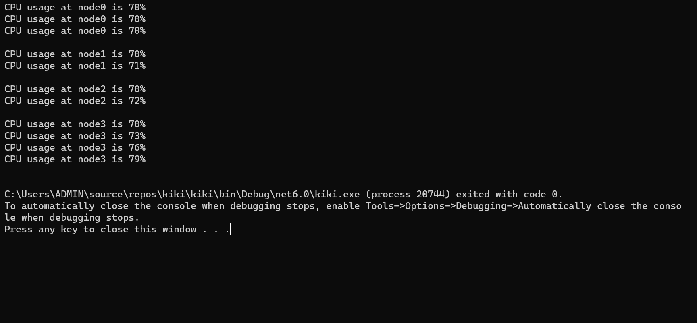

# Ex05-Rec-JaggedArray
## Aim:
To write a C# program to create a sample CPU usage on a network with 4 nodes using a jagged array.
## Algorithm:
### Step1:
Start.
### Step2:
Declare a Jagged Array for four element.
### Step3:
Initialize the elements.
### Step4:
Accessing the elements.
### Step5:
Stop.
<br/><br/><br/><br/><br/><br/>
<br/><br/><br/><br/>

## Program:
```PY
NAME: EZHIL MATHI.R
REG NO:- 212221230026

using System;
namespace jagged_array
{
    class Program
    {
        static void Main(string[] args)
        {
            int[][] cpu = new int[4][];
            {
                cpu[0] = new int[3];
                cpu[1] = new int[2];
                cpu[2] = new int[2];
                cpu[3] = new int[4];
            for (int i = 0; i < 4; i++)
            {
                for (int j = 0; j<cpu[i].Length; j++)
                {
                    cpu[i][j] = i * j + 70;
                }
            }
            for (int i = 0; i<cpu.Length; i++)
            {
                for(int j=0; j<cpu[i].Length; j++)
                {
                    Console.WriteLine("CPU usage at node" + i + " is " + cpu[i][j] + "%");
                }
                Console.WriteLine();
            }


            }
              

        }
    }
}


```
## Output:



## Result:
Thus, the C# program to create a sample CPU usage on a network with 4 nodes using a jagged array is executed successfully.
